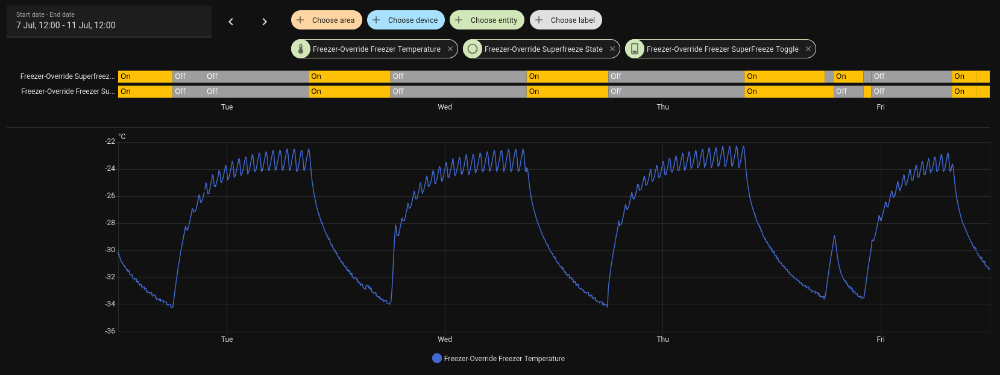

# freezer override
ESPHome-based home automation hardware for Miele FN12827S freestanding freezer for better utilising solar power surplus.

For fun project reasons, I decided to instrument our poorly insulated Miele FN12827S freestanding freezer to be able to turn on the Superfrost functionality at will. 
Superfrost keeps the compressor running although temperature setpoint is reached, undercooling the freezer.
Our solar panel system may export power while the variable spot price of electricity is negative; causing us to pay for producing electricity. It would be better to use this surplus to undercool the freezer, which in turn should mean it would run less when power is no longer free.

As far as I understand, there is no issue in undercooling the wares in the freezer as long as at least -18 C is maintained.

Through [amsreader](https://github.com/UtilitechAS/amsreader-firmware) connected to my Kamstrup Omnipower electrical meter, I can get the current import and export wattage figures every 10s. Our Growatt inverter with ShineWifi-S key running [OpenInverterGateway](https://github.com/OpenInverterGateway/OpenInverterGateway/) firmware, likewise reports produced solar wattage every 10s.

The exposed freezer control is integrated into our local Home Assistant instance. Current automation is very simple; turn on when we export at least 200w to the grid, turn off when we export less than 100w. Additionally, whenever we export and the spotprice is negative, we also turn the freezer on. All automations are debounced by 10 minutes, to avoid toggling the compressor too often.

Realisticly, this over-engineering is unlikely to save any huge amounts as the wattage of the freezer is ~80w and on averaged it consumes ~30w. The added runtime of the compressor may likely also cause it to fail earlier than it would with normal operation. 

Optimistically, this easy-to-implement and barely visible instrumentation could help consume a small amount of power we would otherwise pay for exporting to the grid, and avoid consuming power when expensive afternoon pricing (17-21) occurs. 

Initial testing shows that it takes about an hour before the compressor kicks in again, after Superfrost has been disabled. This is a temperature increase (measured at top of fridge) from -34.5 C to -28 C which seems to indicate the freezer is quite poorly insulated.
Besides the underwhelming performance of the freezer, it also seems that its controller turns off Superfrost erratically, causing a desync between the controllable toggle and the feedback Superfrost-state.

